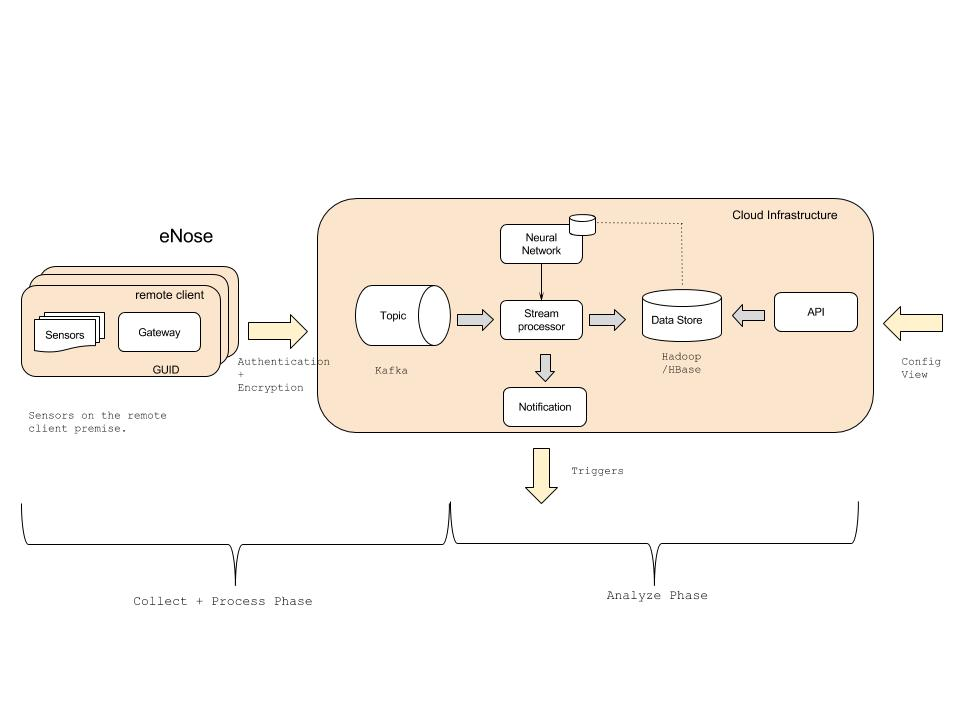

## eNoseLab Project
(Kafka + Spark Streaming + TensorFlow) 

## Objective:

Objective of this project is build an electronic nose that is able to identify different objects inducted before MOX sensors.

Motivated by the [paper](https://www.researchgate.net/publication/305385157_Online_decorrelation_of_humidity_and_temperature_in_chemical_sensors_for_continuous_monitoring).

We will be using the [UCI public dataset](https://archive.ics.uci.edu/ml/datasets/Gas+sensors+for+home+activity+monitoring) to simulate during this experiment.

## High-level System

## Input Data

This dataset has recordings of a gas sensor array composed of 8 MOX gas sensors, and a temperature and humidity sensor. This sensor array was exposed to background home activity while subject to two different stimuli: wine and banana. The responses to banana and wine stimuli were recorded by placing the stimulus close to the sensors. The duration of each stimulation varied from 7min to 2h, with an average duration of 42min. This dataset contains a set of time series from three different conditions: wine, banana and background activity. There are 36 inductions with wine, 33 with banana and 31 recordings of background activity

Source: [UCI public dataset](https://archive.ics.uci.edu/ml/machine-learning-databases/00362/HT_Sensor_UCIsubmission.zip)

- Metadata File Format(HT_Sensor_metadata.dat):
<pre>
id  date        class   t0  dt
0   07-04-15    banana  13.49   1.64 
1   07-05-15    wine    19.61   0.54 
2   07-06-15    wine    19.99   0.66 
3   07-09-15    banana  6.49    0.72 
4   07-09-15    wine    20.07   0.53 
5   07-10-15    banana  16.38   0.80 
6   07-11-15    wine    11.19   0.95
....
</pre>
where,
    * id      = induction id
    * date    = induction date
    * class   = classification
    * t0      = start time
    * dt      = duration

classification: {wine, banana, normal}

- Data File Format(HT_Sensor_dataset.dat:
<pre>
id time       R1         R2         R3         R4         R5         R6         R7        R8        Temp.      Humidity
0  -0.999750  12.862100  10.368300  10.438300  11.669900  13.493100  13.342300  8.041690  8.739010  26.225700  59.052800  
0  -0.999472  12.861700  10.368200  10.437500  11.669700  13.492700  13.341200  8.041330  8.739080  26.230800  59.029900  
0  -0.999194  12.860700  10.368600  10.437000  11.669600  13.492400  13.340500  8.041010  8.739150  26.236500  59.009300  
0  -0.998916  12.860200  10.368600  10.437000  11.669700  13.492100  13.339800  8.040860  8.739360  26.241600  58.990500  
0  -0.998627  12.859500  10.368800  10.437400  11.669900  13.491900  13.339000  8.040870  8.739860  26.246200  58.973600  
0  -0.998349  12.859400  10.369100  10.437600  11.670200  13.492100  13.338200  8.040880  8.740160  26.250300  58.958300  
0
</pre>
where, 
    * id        = induction id
    * time      = reading time
    * R1..8     = MOX sensor readings
    * temp.     = temperature reading
    * humidity  = humidity reading

## Citations:
- Online Decorrelation of Humidity and Temperature in Chemical Sensors for Continuous Monitoring. Chemometrics and Intelligent Laboratory Systems 2016.
presented by Ramon Huerta, Thiago Mosqueiro, Jordi Fonollosa, Nikolai Rulkov, Irene Rodriguez-Lujan.[paper](https://www.researchgate.net/publication/305385157_Online_decorrelation_of_humidity_and_temperature_in_chemical_sensors_for_continuous_monitoring)

## Reference:
- [UCI public dataset](https://archive.ics.uci.edu/ml/datasets/Gas+sensors+for+home+activity+monitoring)
- [GitHub Code to process UCI dataset](https://github.com/thmosqueiro/ENose-Decorr_Humdt_Temp)
